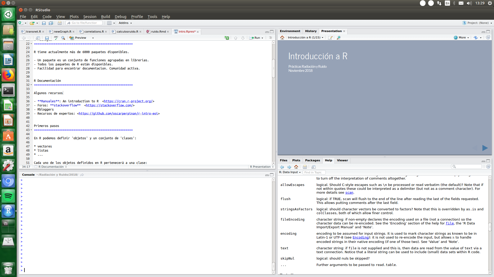
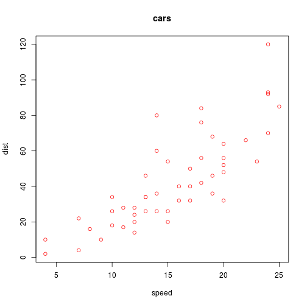

Introducción a R
========================================================
author: Prácticas Radiación y Ruido
date: Noviembre 2018
autosize: true

¿Qué es R?
========================================================

El entorno R puede ser definido como un conjunto de herramientas que, entre otras cosas, facilitan:

- el manejo y el análisis de datos
- la representación gráfica
- un lenguaje de programación, R
- el cálculo de funciones estadísticas

<https://cran.r-project.org/>

R es software libre con licencia GNU-GPL.

R Packages
=======================================================

R tiene actualmente más de 6000 paquetes disponibles.

- Un paquete es un conjunto de funciones agrupadas en librerías.
- Todos los paquetes de R están disponibles.
- Facilidad para encontrar documentacion. Comunidad activa.


R Documentación
=======================================================

Algunos recursos

- **Manuales**: An introduction to R  <https://cran.r-project.org/>
- Foros: **stackoverflow**  <https://stackoverflow.com/>
- Rbloggers
- Recursos de expertos: <https://github.com/oscarperpinan/r-intro-eoi>

Rstudio
=======================================================




Primeros pasos
=======================================================

En R podemos definir 'objetos' y un conjunto de 'clases':

* vectores
* listas
* ...

Cada uno de los objetos definidos en R pertenecerá a una clase:

* numérico
* factor
* data.frame

Primeros pasos
=======================================================

Creando un vector en R:


```r
x <- c(1, 3, 7, 8, 10)
x
```

```
[1]  1  3  7  8 10
```

Podemos ver la clase del objeto que hemos creado utilizando la función class.

```r
class(x)
```

```
[1] "numeric"
```

Primeros pasos
=======================================================
Otras formas de crear vectores:


```r
x <- seq(1, 20, 2)
x
```

```
 [1]  1  3  5  7  9 11 13 15 17 19
```


```r
class(x)
```

```
[1] "numeric"
```

Primeros pasos
=======================================================
Creo una lista

```r
x <- seq(1, 20, 2)
y <- c("a", "b")

lista <- list(x, y)
lista
```

```
[[1]]
 [1]  1  3  5  7  9 11 13 15 17 19

[[2]]
[1] "a" "b"
```


```r
class(lista)
```

```
[1] "list"
```

Primeros pasos
========================================================

Cargo datos por defecto en R y los leo:

```r
data(cars)
head(cars)
```

```
  speed dist
1     4    2
2     4   10
3     7    4
4     7   22
5     8   16
6     9   10
```


Primeros pasos
========================================================

¿qué clase de objeto es 'cars'?

```r
class(cars)
```

```
[1] "data.frame"
```

¿qué tamaño tiene 'cars'?

```r
dim(cars)
```

```
[1] 50  2
```

Primeros pasos
========================================================

Para obtener información sobre lo que hace una función:

```r
?head
```

La descripción de la función y cómo usarla nos aparece en la ventana inferior derecha si usamos Rstudio.

* Puedes echar un vistazo a algunas funciones: 
  - sum
  - max 
  - plot 
  - tail 
  - head 
  - ...

Primeros pasos
========================================================


```r
summary(cars)
```

```
     speed           dist       
 Min.   : 4.0   Min.   :  2.00  
 1st Qu.:12.0   1st Qu.: 26.00  
 Median :15.0   Median : 36.00  
 Mean   :15.4   Mean   : 42.98  
 3rd Qu.:19.0   3rd Qu.: 56.00  
 Max.   :25.0   Max.   :120.00  
```

Primeros pasos
========================================================

¿Puedo extraer la primera columna?

```r
cars1 <- cars[,1]
cars1
```

```
 [1]  4  4  7  7  8  9 10 10 10 11 11 12 12 12 12 13 13 13 13 14 14 14 14
[24] 15 15 15 16 16 17 17 17 18 18 18 18 19 19 19 20 20 20 20 20 22 23 24
[47] 24 24 24 25
```

¿Puedo extraer las filas entre 15 y 30?

```r
carsR <- cars[15:30,]
carsR
```

```
   speed dist
15    12   28
16    13   26
17    13   34
18    13   34
19    13   46
20    14   26
21    14   36
22    14   60
23    14   80
24    15   20
25    15   26
26    15   54
27    16   32
28    16   40
29    17   32
30    17   40
```

Primeros pasos
========================================================
Representación de los datos de 'cars':


```r
plot(cars)
```



Primeros pasos
========================================================
Representación de los datos de 'cars' con algunos cambios:


```r
plot(cars, type='p', col='red', main='cars')
```


Slide With Plot
========================================================


